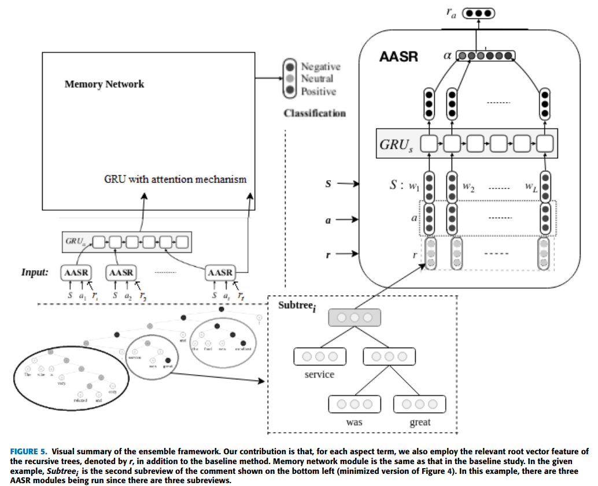

# Combination of Recursive and Recurrent Neural Networks for Aspect-Based Sentiment Analysis Using Inter-Aspect Relations

This repo contains the source code of the paper --

[Combination of Recursive and Recurrent Neural Networks for Aspect-Based Sentiment Analysis Using Inter-Aspect Relations](https://ieeexplore.ieee.org/document/9078752).
Cem Rıfkı Aydın, Tunga Güngör. IEEE Access

This approach proposes a novel neural network framework that combines recurrent and recursive neural models for aspect-based sentiment analysis. By using constituency and dependency parsers, we first divide each review into subreviews that include the sentiment information relevant to the corresponding aspect terms. After generating and training the recursive neural trees built from the parses of the subreviews, we feed their output into the recurrent model. 



## Requirements

- --extra-index-url https://download.pytorch.org/whl/cu118
- numpy
- tensorflow
- keras
- gensim
- jsonschema
- scikit-learn
- scipy
- tqdm 
- regex
- spacy
- pandas
- nltk
- gdown
- torch
- torchvision
- torchaudio

As mentioned, in this study, we combined recurrent and recursive neural network models, based on constituency and dependency parsing separately. We also utilised `Java` for the constituency parser module, provided by Stanford and by downloading this Stanford CoreNLP library for Java. This can later be adapted to utilizing the corresponding Python library, such as Stanza which is not handled here. However, this is not needed for running the dependency module. We used two .csv files, which are the Laptop and Restaurants domains. We relied on Python 3.12 while updating the code a bit further later. The Stanford Core NLP library and GloVe embeddings are downloaded from Google Drive URL paths (https://drive.google.com/uc?id=1-MC8frbFx-O8cW2c5uCzm2KqArLUJdNU and https://drive.google.com/uc?id=1JikYQspoDIxlfhEdv2ry8QkWgZLMrFXZ, respectively), which is handled within the code.

## Execution

Execute the file `ABSA_emb_gpu_final_newarch3.py` to train the model and then evaluate it, based on the test partition.

The following are the command-line arguments:
- `--no-cuda`: Do not use GPU
- `--lr`: Learning rate
- `--l2`: L2 regularization weight'
- `--batch-size`: Batch size
- `--epochs`: Number of epochs
- `--hops`: Number of hops
- `--hidden-size`: Hidden size
- `--output-size`: Output size
- `--dropout-p`: Embedding dropout
- `--dropout-lstm`: LSTM dropout
- `--nb-words`: Number of words in the vocabulary
- `--dataset`: The available choices are `Laptop` or `Restaurants`
- `--embedding-file`: The path to the GloVe embedding file
- `--recursive-module`: The mode to be chosen among dependency, constituency, or baseline (no recursive module incorporated)
- `--dependency-epochs`: Number of epochs for the dependency model, leveraged if the above hyperparameter is chosen as `dependency`
- `--constit-epochs`: Number of epochs for the constituency model, utilized if the `recursive_module` is chosen as `constituency`

You can also change the other relevant hyperparameter sets, specific to the constituency module at `constituency/RecNN.py` and dependency mode at `dependency/treehopper/config.py`. 

#### Setup with virtual environment (Python 3):
-  python3 -m venv my_venv
-  source my_venv/bin/activate

Install the requirements:
-  pip3 install -r requirements.txt

If everything works smoothly without any errors, you can run the example usage given below.

### Example Usage:

- The following guide shows an example usage of the model in performing ABSA training and the evaluation.
- Instructions
      
      1. Change directory to the location of the source code (i.e., `ABSA_emb_gpu_final_newarch3.py`)
      2. Run the instructions in "Setup with virtual environment (Python 3)"
      3. Run the `ABSA_emb_gpu_final_newarch3.py` file with chosen command parameters. Some examples are given below

Examples:
```
- python ABSA_emb_gpu_final_newarch3.py --recursive-module dependency --lr 0.001 --l2 0.0001 --dataset Laptop --hops 3 --epochs 7 --hidden-size 400 --output-size 300 --dropout-p 0.1 --dropout-lstm 0.2
- python ABSA_emb_gpu_final_newarch3.py --recursive-module constituency --constit-epochs 2 --lr 0.001 --l2 0.0001 --dataset Restaurants --hops 3 --epochs 7 --hidden-size 400 --output-size 300 --dropout-p 0.1 --dropout-lstm 0.2
- python ABSA_emb_gpu_final_newarch3.py --recursive-module baseline --lr 0.001 --l2 0.0001 --dataset Laptop --hops 3 --epochs 7 --hidden-size 400 --output-size 300 --dropout-p 0.1 --dropout-lstm 0.2

```
## Citation

If you find this code useful, please cite the following in your work:
```
@ARTICLE{9078752,
  author={Aydin, Cem Rifki and Güngör, Tunga},
  journal={IEEE Access}, 
  title={Combination of Recursive and Recurrent Neural Networks for Aspect-Based Sentiment Analysis Using Inter-Aspect Relations}, 
  year={2020},
  volume={8},
  number={},
  pages={77820-77832},
  keywords={Sentiment analysis;Task analysis;Recurrent neural networks;Analytical models;Syntactics;Portable computers;Aspect-based sentiment classification;ensemble neural network model;recurrent neural networks;recursive neural networks;sentiment analysis},
  doi={10.1109/ACCESS.2020.2990306}}

```
## Credits
The code was written by Cem Rifki Aydin
